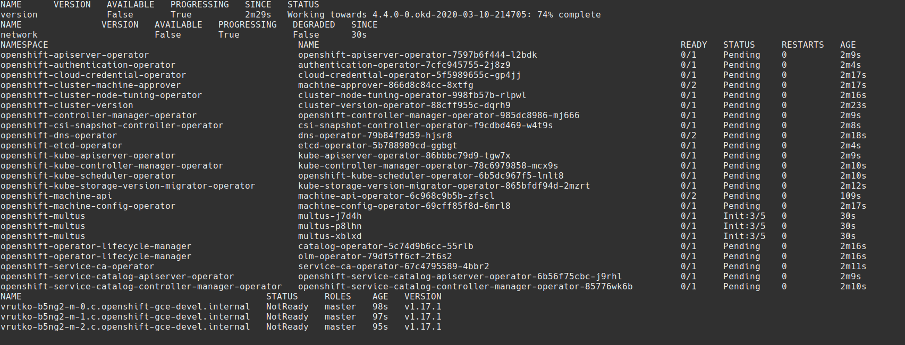

## OKD install on GCP
### Screenshot tour

Vadim Rutkovsky

vrutkovs@redhat.com

---

### Goals

* Install OKD 4.4 on GCP via IPI flow
* Show known issues

---
### Install config template

---
### Custom wrapper around installer

https://github.com/vrutkovs/okd-installer

---
### Pull latest installer image

---
### Check version and release image

---
### Template install-config

---
### Run `create cluster` from container

---
### Store cluster output in `clusters/<name>`

---
### Mount GCP credentials

---
### Start cluster install

---
### Override FCOS image location and release image

---
### Installer output

---
### GCP masters created

---
### Bootstrap node

---
### Bootkube: pivot

---
### Bootkube: updated bootstrap

---
### Bootkube: watch install progress

---
### Bootkube: network

---
### Bootkube: masters are ready

---
### machine-api for workers

---
### Workers on GCP console

---
### Workers joining the cluster

---
### Operators doing the needful

---
### tada.wav

---
### Authentication files

---
### Known issues with GCP

* FCOS is not yet officially uploaded

  Workaround: upload `tar.gz` manually and use
  
  `OPENSHIFT_INSTALL_OS_IMAGE_OVERRIDE="
  https://storage.googleapis.com/..."`

* "Waiting up to 40m0s for bootstrapping to complete" never completes, although cluster is setup
  
  Destroy bootstrap node manually

---
## Questions?

https://vrutkovs.github.io/slides-okd-installer-screenshots
